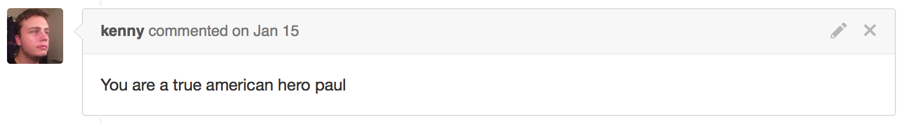

# Rapid View Prototyping Using FBSnapshotTestCase

## Paul Rehkugler
### https://pr.tumblr.com
### @paulrehkugler

^ Paul Rehkugler. Senior iOS Developer at Tumblr. Core Team (Jasdev & Kenny, frameworks, continuous integration, etc)

---

# Rapid View Prototyping

- See the results of UI changes in near-real time during development.
- See results of UI changes across all devices.

^ WYSIWIG editors like Interface Builder's Assistant Editor pane.
^ FBSnapshotTestCase is not really built to be a rapid view prototyping tool, but you can use it as one.

---

# FBSnapshotTestCase

- Library that allows you to unit test the appearance of views.
- You provide a directory path, and tell it to test a view.
- It generates snapshots and diffs the snapshots. If there is no difference, the test passes.

^ testing library that allows you to unit test the appearance of views.

---

# Setting up FBSnapshotTestCase

- Add as a test dependency via CocoaPods.
- Instead of subclassing `XCTestCase`, subclass `FBSnapshotTestCase`.
- Run with `recordMode = true` to generate snapshots.
- Run with `recordMode = false` to compare against snapshots.

^ This is how I set up the demo. Your mileage may vary.

^ Now that you have some background as to the scope, we're going to talk about actually prototyping using FBSnapshotTestCase

---

# Rapidly Prototyping Views Using FBSnapshotTestCase

---

# Goals for Rapid Prototyping

- Get nearly immediate feedback during development.
- Test across all devices.

^ get nearly immediate feedback during development and test across all known iOS devices.

---

# Nearly Immediate feedback

- Run the tests often during development.
- Keep them in `recordMode` throughout development.

^ it's on you! run the tests frequently during development and keep them in recordMode to generate snapshots frequently.

---

# Test Across All devices

- `DeviceOrientation` helper struct.

```swift
struct DeviceOrientation {
  let horizontalSizeClass: UIUserInterfaceSizeClass
  let verticalSizeClass: UIUserInterfaceSizeClass
  let screenSize: CGSize
  let name: String
}
```

^ i built this device orientation helper struct to encapsulates all differences that will affect layout across all devices

^ horizontal size class, vertical size class, screen size

^ name is an identifier that makes the filenames easier to read

---

# `DeviceOrientation` continued

```swift
static func iPhone4Portrait() -> DeviceOrientation {
		return DeviceOrientation(
				horizontalSizeClass: .Compact,
				verticalSizeClass: .Regular,
				screenSize: CGSize(width: 320, height: 480),
				name: "iPhone4Portrait")
}

static func allDeviceOrientations() -> [DeviceOrientation] { ... }
```

^ individual convenience functions for all current iOS devices

^ allDeviceOrientations convenience function to easily iterate over all devices

---

# Using DeviceOrientation

- `UIViewController` extension can set up `UIViewController` containment
- `setOverrideTraitCollection(collection:, forChildViewController:)`
- set `frame` of the `childViewController`'s `view` to the `deviceOrientation`'s `screenSize`.

```swift
extension UIViewController {
    func setup(viewControllerForTesting viewController: UIViewController, inDeviceOrientation deviceOrientation: DeviceOrientation) { ... }
```
^ UIViewController containment extension

^ override trait collection to simulate size classes

^ set frame of the child view controller's view to get a real-world layout based on those size classes

---

# Example Test

```swift
var viewController = UIViewController()

func testViewControllerAppearance() {
	DeviceOrientation.allDeviceOrientations().forEach { deviceOrientation in
		// parent view controller for containment
		viewController = UIViewController()
		viewController.view.frame = UIScreen.mainScreen().bounds

		// child view controller
		let testingViewController = ViewController()

		// set up for testing
		viewController.setup(viewControllerForTesting: testingViewController, inDeviceOrientation: deviceOrientation)

		// take snapshot
		FBSnapshotVerifyView(testingViewController.view, identifier: deviceOrientation.name)
	}
}
```

^ set up a parent view controller for containment. can be a vanilla UIViewController because of the extension we wrote

^ child view controller is of type ViewController

^ call setup() extension

^ let FBSnapshotVerifyView take a snapshot

---

# Demo

---

# Writing Testable `UIViewController`s

- Use dependency injection for sources of data, instead of firing off network requests from within your view controllers.
- Separate layout from logic by making a custom `UIView` subclass and rapidly iterating on that instead.

^ view controllers sometimes have lots of different states. think about how you can compose things that change those states into your view controllers. what sets it to loading? what sets the data in your view controller?

^ if it's not possible to inject different behavior so that you can get consistent snapshots in your view controller, make a custom `UIView` subclass to handle layout, and mutate properties on that instead

---

# Why?

- At the end of this, you have working unit tests
- Works with and without Interface Builder, so you can appease people that like to write layout in code

^ working unit tests - people cannot modify shared ui components or shared constants and mess up your code. if you write these across your app, you can easily see what breaks across iOS SDK upgrades

^ works with interface builder, even things that aren't IBDesignable, so that you can see what these look like in the real world

---

# Feedback on Adding FBSnapshotTestCase at Tumblr



^ your coworkers will love you

---

# Learn More

- Source Code on GitHub: [https://github.com/paulrehkugler/Snapshot-Test-Case-Talk/](https://github.com/paulrehkugler/Snapshot-Test-Case-Talk/)

- [@paulrehkugler](http://twitter.com/paulrehkugler)
- [cocoa.tumblr.com](https://cocoa.tumblr.com)
